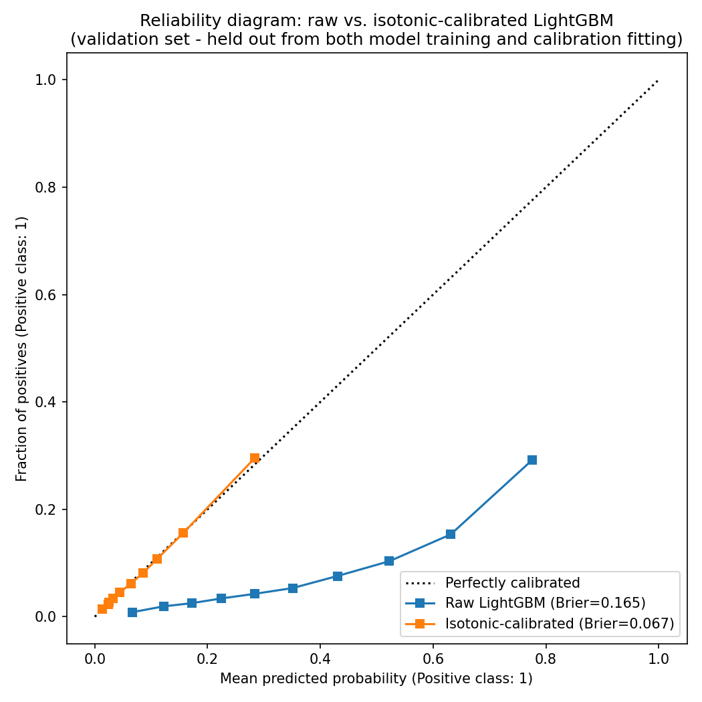
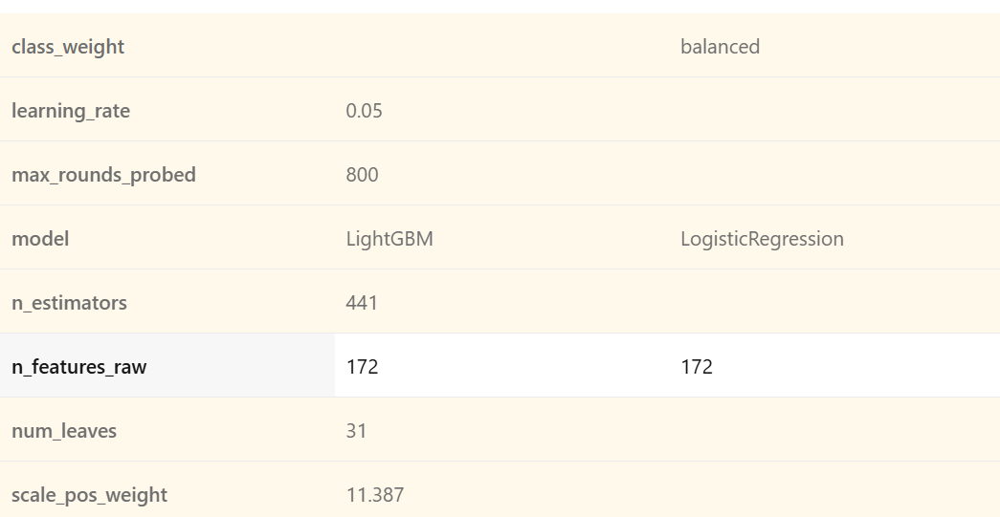
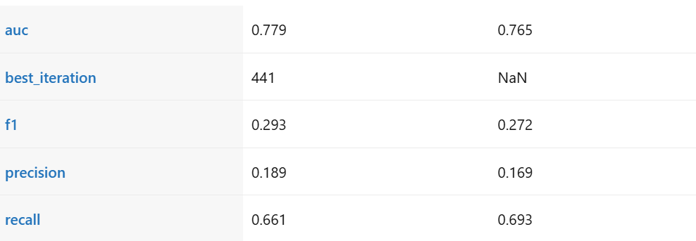
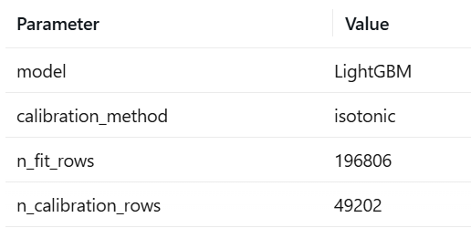
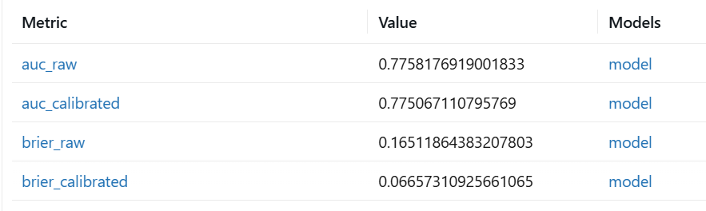

# Credit Risk / Loan Default Predictor
## Project Report

*Numeric results and screenshots (marked [fill in] or [X]) require actual model training and are left for you to complete. Everything else below is written content, ready to use or adapt.*

---

> **Differentiation opener** *(place this at the top of your GitHub README too, not just here — this is the first thing a recruiter or interviewer should read)*:
> You've probably seen a Home Credit Default Risk notebook before — here's what's different about this one: a **calibrated** model (not just AUC-optimized) and a **RAG-grounded Adverse Action Notice generator** that cites real ECOA/Regulation B and OSFI E-23 text, with its own citations audited for faithfulness.
>
> **Hero visual:** [insert a 10–15 second GIF/screen-capture here once deployed — the actual flow: an application scored → a decision returned → the cited Adverse Action explanation generated. This should be the first visual element anyone sees, above the architecture diagram in Section 6.]

---

## 1. Executive Summary

*Written in business language deliberately — no model names or technical terms here. That's not a simplification for its own sake: a consulting or risk-leadership audience reads this section, and DeepSeek's instinct on this point was correct — save "LightGBM," "SHAP," and "RAGAS" for Section 3 onward.*

Lenders must decide, at scale, who receives credit and at what risk — a decision that is both a commercial judgment (will this loan be repaid) and a legal one (can the reason for denial be explained to the applicant, as required by law). Most student credit-risk projects address only the first half of that problem: they optimize a score and stop. This project addresses both — accuracy and legal explainability — in one system.

- **The Problem:** Lending decisions must be accurate and legally explainable at the same time — a risk score alone does not satisfy the requirement to give an applicant a specific reason when credit is denied.
- **The Solution:** An interpretable risk-scoring system that predicts probability of default with calibrated, trustworthy confidence, and automatically generates a specific, evidence-backed explanation for every declined application, citing the actual policy and regulatory text behind the decision.
- **Key Findings:** [Fill in once built — e.g., "Debt-to-income ratio and recent credit inquiries were the two strongest predictors of default"; "Raw model probabilities were meaningfully overconfident before calibration"]
- **Business Recommendation:** [Fill in once built — a specific cutoff recommendation and the tradeoff it implies, e.g., "We recommend a risk cutoff of X%, balancing an approval rate of Y% against an estimated Z% reduction in expected losses"]
- **Next Steps:** A phased path to real deployment — shadow-mode testing, compliance review, then a limited pilot (see Section 5.4).

**Headline results (fill in once built):** AUC [X], calibration improvement (Brier score) [X → X], explanation faithfulness score [X].

---

## 2. Problem Definition & Business Context

### 2.1 Business Challenge

A lender evaluating a loan application has to balance two competing pressures: approve too liberally and expected losses from defaults erode profitability; approve too conservatively and the business loses revenue and shuts out creditworthy applicants. This tradeoff is not a modeling detail — it's the actual business decision the model exists to support, and the right way to present it is as a cutoff/threshold choice with an explicit cost tradeoff, not as an abstract accuracy number. Framed the way a consulting engagement (PwC/EY-style) would frame it: the deliverable isn't "a model," it's a decision-support tool plus a recommendation for where to set the approval threshold and why.

### 2.2 Regulatory Context (Adverse Action Notices)

**U.S. framework:** Under the Equal Credit Opportunity Act (ECOA), implemented through Regulation B (12 CFR §1002.9), a creditor that denies an application — or offers materially worse terms than requested — must notify the applicant and provide either the specific reasons for the decision or a clear route to request them. Critically, Regulation B requires that the stated reasons be *specific*: a statement that the decision was "based on the creditor's internal standards or policies" does not satisfy the requirement.

Two CFPB Circulars make the AI-specific implication explicit rather than inferred. **CFPB Circular 2022-03** answers directly: when a complex algorithm makes it harder to identify the specific reasons behind a denial, does the specific-reasons requirement still apply? Yes — "the legal requirement is the same" regardless of whether a creditor uses a sophisticated ML model or a simple scorecard. Model complexity is not an excuse. **CFPB Circular 2023-03** goes further: creditors cannot fall back on Regulation B's generic sample-form reasons if those reasons don't specifically and accurately reflect what the model actually relied on — "nor may they rely on overly broad or vague reasons to the extent that they obscure the specific and accurate reasons relied upon." Its own example is a credit-line reduction driven by behavioral spending data, where the required explanation must name the specific negative behavior, not a vague label like "purchasing history." Taken together, these two Circulars are this project's actual regulatory thesis: automated systems don't reduce a creditor's obligation to provide specific, accurate reasons — they raise the bar for proving it, which is exactly the gap SHAP + a citation-audited RAG layer are built to close (Section 4).

**Canadian framework — directly relevant to RBC and National Bank:** federally regulated Canadian financial institutions are governed by OSFI's **Guideline E-23 (Model Risk Management, 2027)**, finalized September 2025 and taking effect **May 1, 2027**. Unlike the 2017 version, the revised E-23 explicitly brings AI/ML models into scope, and introduces **AI-specific explainability controls** and **mandatory independent validation for any model carrying non-negligible risk** — credit-adjudication models are named directly as a covered use case. This is a stronger, more specific, and more current citation than a general reference to "Canadian consumer protection law": it's the actual federal supervisory framework RBC's and National Bank's own model risk teams will be building toward by the time you'd be starting a career there, which makes this project's explainability and validation-mindedness directly relevant to a real, dated regulatory deadline.

This is precisely the gap this project's explainability and RAG-generation layers are built to close: SHAP identifies the specific factors driving an individual decision, and the RAG layer grounds the resulting explanation in the actual regulatory and policy language, rather than a vague or templated statement.

### 2.3 Stakeholders

| Stakeholder | Interest |
|---|---|
| Credit risk team | Accurate, calibrated risk scores that reflect true default likelihood |
| Compliance/legal | Defensible, specific denial reasons that satisfy Regulation B / OSFI E-23, and an audit trail for how each reason was generated |
| Applicants | Fair, understandable decisions and accurate explanations when declined |
| Business/finance leadership | Portfolio-level expected loss, approval-rate tradeoffs, and a clear basis for setting policy |

### 2.4 Success Metrics

Both ML metrics and business/compliance metrics are tracked — a model that scores well on AUC alone but produces uncalibrated probabilities or ungrounded explanations would not be considered a success for this project, even if the classification metrics looked strong.

| Metric | Target | Actual |
|---|---|---|
| AUC | ≥ 0.75 (competitive full solutions to this dataset typically land 0.78–0.80; DeepSeek's suggested >0.80 bar is a fine stretch goal, but ≥0.75 is the honest floor for a solo, time-boxed build) | [fill in] |
| Brier score (post-calibration) | Meaningfully lower than pre-calibration Brier score, with a visibly tighter reliability diagram | [fill in] |
| RAGAS faithfulness (Adverse Action explanations) | ≥ 0.80 (high faithfulness; below this indicates the generator is drifting from the retrieved source text) | [fill in] |
| Business: expected loss reduction at recommended cutoff | Directionally positive vs. a naive/no-model baseline, reported with explicit assumptions | [fill in] |

---

## 3. Data & Methodology

### 3.1 Data Source & Description

The dataset is Kaggle's **Home Credit Default Risk** competition, a real, anonymized dataset released by Home Credit Group. It spans multiple related tables rather than a single flat file, which is part of what makes the feature-engineering step substantive rather than trivial:

- **`application_train.csv`** — the core table, one row per loan application (~307,500 applications, ~122 columns), including the binary target (`TARGET`: 1 = defaulted, 0 = repaid).
- **`bureau.csv`** — the applicant's credit history reported to the credit bureau by other lenders (millions of rows, many-to-one with `application_train`).
- **`previous_application.csv`** — the applicant's prior loan applications with this lender.
- **`credit_card_balance.csv`** — monthly balance/utilization history on any previous credit cards held with this lender.

The target class is heavily imbalanced: **8.07%** of the 307,511 applications in the training set are associated with a default (`TARGET == 1`), and 91.93% are not — this imbalance is the single most important data characteristic shaping the modeling and evaluation choices throughout this report (see 3.4 and 2.4). Confirmed directly against the raw data (see `pipeline/eda.ipynb`, Section 2), not taken on the roadmap's word.

### 3.2 Exploratory Data Analysis (EDA)

Full analysis, code, and plots: `pipeline/eda.ipynb`. Four findings from this pass materially shape later phases:

**1. Class imbalance (8.07% default) is the defining fact of this dataset** — a model that always predicts "no default" would already look 92% "accurate" while being useless, which is why AUC/precision/recall are used throughout this report instead of accuracy (Section 2.4, 3.4).

**2. Missingness is informative, not just incomplete, in at least one important case.** Applicants with no bureau record (14.3% of the training set) default at **10.12%**, versus **7.73%** for applicants who do have one — a ~2.4-point gap consistent with thin-file/first-time borrowers being a genuinely different risk profile, not a data-entry gap. Action for Phase 4: an explicit `HAS_BUREAU_HISTORY` flag, not silent imputation of bureau-derived columns.

**3. `DAYS_EMPLOYED` contains a sentinel-value bug that is itself predictive.** 18.0% of applicants carry the value 365,243 (~1,000 years) in this column — almost certainly a placeholder for "not currently employed" (pensioners/retirees). That group defaults at **5.40%**, versus **8.66%** for everyone else, i.e. this population is *safer*, not noisier. Action for Phase 4: replace the sentinel with NaN and add an `IS_DAYS_EMPLOYED_ANOMALY` flag, since the flag itself carries signal a raw numeric value would otherwise destroy (a model would otherwise read "employed for 1,000 years" as a huge, meaningless number).

**4. The three external bureau scores (`EXT_SOURCE_1/2/3`) are the strongest linear predictors checked**, consistent with both reference repos (`kozodoi`, `NoxMoon`): correlation with `TARGET` is `EXT_SOURCE_3` = -0.179, `EXT_SOURCE_2` = -0.160, `EXT_SOURCE_1` = -0.155, versus -0.004 for raw income and -0.030 for raw credit amount. These are third-party credit-worthiness scores Home Credit was handed as inputs — the project's job is adding value on top of them via the auxiliary-table feature engineering (Section 3.3), not out-competing them from scratch. Missingness varies sharply across the three (`EXT_SOURCE_1`: 56.4% missing, `EXT_SOURCE_3`: 19.8%, `EXT_SOURCE_2`: 0.2%), which is expected to affect how much a tree model can actually lean on each one in practice, independent of raw correlation strength.

Five concrete hypotheses about expected SHAP rankings are recorded in the notebook before any model exists, specifically so Section 4.1 can check actual SHAP output against a pre-registered prior instead of a post-hoc story.

### 3.3 Feature Engineering

The auxiliary tables carry most of the real predictive signal in this dataset — an applicant's own application form is far less informative than their actual credit history and behavior. Feature engineering here means aggregating each auxiliary table to one row per applicant (via group-by + aggregation) and joining onto the core application table.

Implemented in `pipeline/features.py`, adding **52 engineered/aggregated columns** to the 122 raw `application_train` columns (307,511 rows in, 307,511 rows out — every left-join is one-row-per-applicant on both sides, so no row duplication).

| Feature group | Source table | Rationale | Example correlation with `TARGET` |
|---|---|---|---|
| Bureau credit history aggregates (count of credits, active-credit ratio, overdue amounts, debt-to-credit ratio, `HAS_BUREAU_HISTORY` flag) | `bureau.csv` | A history of overdue or defaulted credit elsewhere is one of the strongest available signals of future default risk; the missingness flag was an explicit EDA finding, not an afterthought | `BUREAU_ACTIVE_RATIO`: +0.077, `BUREAU_DEBT_CREDIT_RATIO`: +0.060 |
| Previous application outcomes (approval/refusal rate, requested vs. granted amount ratio, recency) | `previous_application.csv` | Past behavior with this specific lender is a direct, relevant signal not available from bureau data alone | `PREV_REFUSAL_RATE`: +0.078, `PREV_APPROVAL_RATE`: -0.064 |
| Credit card utilization patterns (mean/max balance-to-limit ratio, late-payment rate) | `credit_card_balance.csv` | High or worsening utilization is a well-established leading indicator of financial distress | `CC_UTILIZATION_MEAN`: +0.136 (the strongest of the newly engineered features after the `EXT_SOURCE` aggregate) |
| Applicant-level ratios and cleaning (`CREDIT_INCOME_RATIO`, `ANNUITY_INCOME_RATIO`, cleaned `DAYS_EMPLOYED` + anomaly flag, age/employment in years) | `application_train.csv` (derived) | Raw income and credit amount are individually weak (EDA: -0.004 correlation for raw income); the *ratio* and the cleaned employment fields carry more signal | `AGE_YEARS`: -0.078, `IS_DAYS_EMPLOYED_ANOMALY`: -0.046 |
| `EXT_SOURCE` consensus features (row-wise mean/std/count-available across `EXT_SOURCE_1/2/3`) | `application_train.csv` (derived) | Each of the three raw scores has very different missingness (56%/0.2%/20%); averaging whichever are present gives one more-complete score | `EXT_SOURCE_MEAN`: **-0.222** — stronger than any individual raw `EXT_SOURCE` column (best individual was `EXT_SOURCE_3` at -0.179) |

**Data-quality bugs caught and fixed during this phase** (worth stating explicitly, since this is exactly the kind of thing that silently corrupts a model if missed): two ratio features divided by a legitimately-zero denominator (`BUREAU_AMT_CREDIT_SUM_SUM` for a small number of applicants with only closed/written-off credit lines; `AMT_APPLICATION` for a known subset of `previous_application.csv` rows) and produced `inf` rather than a large-but-real number. Both were caught by an explicit post-build check for infinite values across the whole table (not assumed absent) and fixed by treating a zero denominator as "ratio undefined" (`NaN`) rather than a real value — `NaN` is handled natively by LightGBM's split-finding, `inf` is not and would have silently broken training or produced nonsensical splits.

### 3.4 Model Selection & Experimentation

Two models are trained and compared honestly, following the same principle used elsewhere in this portfolio: report whichever model actually generalizes better on held-out data, not whichever has the more impressive training-set number. Logistic regression serves as an interpretable baseline (and a useful sanity check, since its coefficients are directly interpretable without SHAP); LightGBM is the primary candidate, chosen over a neural network because tabular data with well-engineered features generally favors gradient-boosted trees at this data scale, and because `TreeExplainer` (Section 4.1) provides fast, exact SHAP values for tree models specifically.

Both models are trained on an 80/20 stratified split of the Phase 4 feature table (246,008 train / 61,503 validation rows, both preserving the 8.07% default rate), using class weighting rather than resampling to address the imbalance (`class_weight="balanced"` for logistic regression, `scale_pos_weight` — the actual train-split majority:minority ratio, ~11.4 — for LightGBM). Precision/recall/F1 are reported at a fixed 0.5 threshold purely as a comparable reference point between the two models; the real business decision threshold is set later, in Section 5.2.

| Model | AUC (val) | Precision | Recall | F1 |
|---|---|---|---|---|
| Logistic Regression (baseline) | 0.7647 | 0.169 | 0.693 | 0.272 |
| **LightGBM** | **0.7793** | 0.189 | 0.661 | 0.293 |

LightGBM outperforms the logistic regression baseline on AUC by a meaningful margin (+0.015) — consistent with the expectation from Section 3.4's model-choice rationale, and already close to the ~0.79–0.80 full-ensemble benchmark the roadmap's reference repos report, from a single untuned LightGBM run on 52 engineered features (Section 3.3) rather than an ensemble. Both runs are tracked in MLflow (`modeling/train.py`, experiment `credit-risk-phase5`, local SQLite backend at `mlflow.db`).

**A real debugging finding worth recording, not smoothing over:** LightGBM 4.7.0's built-in early-stopping callback was found to select the *worst* validation round (iteration 1 of hundreds, on a validation AUC curve that was monotonically improving) as the "best" one — but only when `scale_pos_weight` is set; removing it alone restored correct behavior. This pointed to a real bug in this LightGBM release's early-stopping direction detection under sample weighting, not a modeling error. The fix implemented in `train.py`: train a generous number of rounds (800) without relying on the automatic callback, read the validation AUC curve directly from `evals_result_`, and manually select the true best iteration (441, AUC 0.7793) before training a second, right-sized model on exactly that many rounds. Worth stating explicitly in an interview: the first LightGBM AUC observed (0.7245, *below* the logistic regression baseline) was wrong for a diagnosable reason, not just "worse" — treating a suspicious result as a bug to investigate, rather than a number to report, is what caught it.

### 3.5 Model Calibration

A model's AUC measures how well it *ranks* applicants by risk, but says nothing about whether its predicted probabilities are trustworthy in an absolute sense — and for a real lending decision (setting a cutoff, pricing a loan, estimating expected portfolio loss), the actual probability value matters, not just the ranking. This project checks calibration explicitly via a reliability diagram (predicted probability vs. observed default rate, binned) and the Brier score, and applies isotonic regression if the raw model output is poorly calibrated. **It is** — and for a specific, predictable reason rather than a generic LightGBM quirk: Phase 5's `scale_pos_weight≈11.4` correction (needed to make the model rank the minority class well under 8% imbalance) systematically distorts the raw output away from the true base rate. Calibration here is undoing a known side effect of that earlier, deliberate choice, not patching an unrelated flaw.

**Methodology:** the calibrator is fit on a dedicated calibration slice (49,202 rows) carved out of the training data — not on the same validation set used to evaluate it, which would make "it's calibrated now" a claim about memorization rather than genuine calibration. The validation set (61,503 rows) used for the numbers below is identical to Phase 5's and was touched by neither the classifier's training nor the calibrator's fitting. Isotonic regression was chosen over Platt (sigmoid) scaling because the calibration slice is large (tens of thousands of rows, enough to avoid overfitting a flexible, non-parametric fit) and there's no reason to assume the `scale_pos_weight`-induced distortion is sigmoid-shaped.

**Results** (`modeling/calibration.py`, MLflow run `lightgbm_calibration`):

| | Raw LightGBM | Isotonic-calibrated |
|---|---|---|
| AUC | 0.7758 | 0.7751 |
| Brier score | 0.165 | **0.067** |

The reliability diagram above shows the raw model (blue) badly over-predicting risk across the entire range — at a mean predicted probability of ~0.6, the true observed default rate is only ~0.15, and the gap between the blue curve and the dotted diagonal (perfect calibration) widens as predicted probability increases. This is a direct, visible confirmation of the `scale_pos_weight` distortion predicted before this phase was built, not a coincidental finding. The isotonic-calibrated curve (orange) tracks the diagonal closely across its full range, which is why the Brier score improvement (0.165 → 0.067) is trustworthy rather than an artifact of a lucky bin or two. AUC changed by only -0.0007 between the two curves (isotonic regression can only ever preserve or flatten the model's ranking via ties — never reverse it — so this negligible drop, not an improvement, is the theoretically expected outcome, and its size confirms the ranking was essentially undisturbed by calibration).

---

## 4. Explainability & Regulatory Compliance

### 4.1 SHAP Analysis (Global & Local)

SHAP (Shapley Additive exPlanations) values are used because they have a principled game-theoretic guarantee — the attribution to each feature reflects that feature's actual marginal contribution to the prediction, averaged over all possible orderings of features, rather than an ad hoc importance heuristic. `TreeExplainer` is used specifically because LightGBM is a tree-based model, for which `TreeExplainer` is both exact and fast, unlike the slower model-agnostic explainer needed for arbitrary model types.

Two views are produced: a **global** summary plot (which features matter most across the whole validation set) and **local** explanations (force/waterfall plots for individual predictions, especially declined applicants, since those are the ones that feed the Adverse Action generator in 4.2). Based on public analysis of this dataset, the external credit bureau scores (`EXT_SOURCE_1/2/3`), days employed, and the engineered credit-to-income ratio are reasonable hypotheses for top global features — worth checking your actual SHAP output against this expectation, and against your own EDA hypotheses from 3.2, and explaining any surprises rather than silently accepting them.

[Fill in — insert SHAP summary plot + at least one local force/waterfall plot for a declined applicant]

### 4.2 Adverse Action Notice Generator

This is the component that directly answers the regulatory gap described in Section 2.2. For a declined applicant, the pipeline works as follows: (1) SHAP identifies the top-3 factors pushing that applicant's prediction toward default; (2) those factors are used as a retrieval query against a curated corpus — the actual text of 12 CFR §1002.9, CFPB's published model Adverse Action notice forms, and a short internal-style policy document (written for this project) explaining what each model feature means in plain English; (3) an LLM generates a plain-English, specific explanation grounded in the retrieved text; (4) the generated explanation is checked with RAGAS's faithfulness metric to confirm it only makes claims supported by what was actually retrieved, rather than inventing plausible-sounding but ungrounded detail.

**Example walkthrough:**
- Applicant profile: [anonymized/synthetic example — e.g., requested credit amount, income, employment length]
- Top SHAP factors: [list the actual top-3 factors for this applicant]
- Retrieved source text: [quote the retrieved regulatory/policy chunk]
- Generated explanation: [the actual generated output]
- Faithfulness check: [pass/fail + RAGAS score]

**Aggregate evaluation:** [X/20 generated notices passed the faithfulness check; RAGAS faithfulness score: X]

*Note for the report:* it's worth being explicit that this generator is a prototype demonstrating the pattern, not a compliance-certified system — a real deployment would require legal/compliance sign-off on the underlying policy corpus and human review of generated notices, a point worth restating in Section 8.

---

## 5. Business Case & Recommendations

### 5.1 Risk Segmentation

Applicants are grouped into risk bands based on predicted (calibrated) probability of default — for example, low (<5%), medium (5–15%), and high (>15%) — with the population share and observed/expected default rate reported for each band. This segmentation is what turns an individual-level probability score into something a business stakeholder can act on at a policy level (e.g., "auto-approve the low band, manually review the medium band, decline the high band").

[Fill in — insert segmentation table/chart with actual band definitions and population shares once the calibrated model is available]

### 5.2 Risk-Return Tradeoff Analysis

The choice of approval cutoff is a business decision, not a purely statistical one: a stricter cutoff reduces expected losses but also rejects some applicants who would have repaid (lost revenue), while a looser cutoff approves more revenue-generating applicants but accepts more expected loss. This table exists to make that tradeoff explicit and let a business stakeholder choose a cutoff deliberately, rather than accepting a default threshold (like 0.5) with no justification.

| Cutoff | Approval rate | Expected default rate among approved | Expected loss |
|---|---|---|---|
| [ ] | [ ] | [ ] | [ ] |

[Populate this table across at least 3–5 candidate cutoffs once the calibrated model is available]

### 5.3 Financial Impact Projection

This section translates the cutoff analysis above into an illustrative dollar-impact estimate — for example, "at the recommended cutoff, expected portfolio loss decreases by an estimated $X per 1,000 applications relative to a no-model (approve-everyone) baseline, at a cost of an estimated Y fewer approvals." State all assumptions explicitly (average loan size, assumed loss-given-default rate) since this is a directional business estimate, not a precise forecast, and overstating its precision would undercut the credibility of the rest of the report.

[Fill in once cutoff analysis in 5.2 is complete]

### 5.4 Implementation Roadmap

If this system were being considered for actual deployment rather than as a portfolio project, a realistic phased path would look like:

| Phase | Duration | Focus | KPIs to track |
|---|---|---|---|
| Pilot | 1–3 months | Shadow-mode: run alongside existing underwriting without acting on output, to validate real-world calibration | Calibration drift, override rate (how often the model would have disagreed with human decisions) |
| Controlled rollout | 3–6 months | A/B test on a subset of new applications; compliance/legal review of fairness properties and the policy corpus | Approval rate, default rate, time-to-decision, override rate |
| Full deployment | 6–12 months | Phased integration into the underwriting workflow with continued monitoring | Portfolio expected loss vs. baseline, drift alerts (Evidently), notice-generation faithfulness rate |

This roadmap is itself worth including in the report, since it demonstrates an understanding that a working prototype and a production-ready regulated system are not the same thing — a distinction consulting and fintech interviewers specifically probe for, and one that also maps directly onto OSFI E-23's expectation of independent validation before a model carrying non-negligible risk goes live (Section 2.2).

---

## 6. Technical Implementation

### 6.1 System Architecture

The system is organized as a linear pipeline with a branch for the compliance layer:

**Data pipeline** (multi-table ingestion and feature engineering) → **Model** (LightGBM, compared against logistic regression baseline) → **Calibration** (isotonic/Platt correction on top of raw model output) → **SHAP** (global and per-prediction local explanations) → for declined applicants specifically → **RAG generator** (retrieval over the compliance corpus in pgvector, grounded generation, RAGAS faithfulness check) → **FastAPI** (serving layer exposing all of the above) → **Power BI dashboard** (business-facing view of risk segments and cutoff tradeoffs, reading from the same underlying data).

[Insert an actual architecture diagram once the system is built — a simple boxes-and-arrows diagram following the flow above is sufficient]

### 6.2 API Endpoints

| Endpoint | Method | Example input | Example output |
|---|---|---|---|
| `/predict` | POST | `{"applicant_id": 1234, "features": {...}}` | `{"probability_of_default": 0.12, "calibrated": true, "recommendation": "approve"}` |
| `/explain/{id}` | GET | Applicant ID | `{"top_factors": [{"feature": "DEBT_TO_INCOME", "shap_value": 0.34}, ...], "global_importance_url": "..."}` |
| `/adverse-action/{id}` | GET | Applicant ID | `{"reasons": [...], "retrieved_sources": [...], "faithfulness_score": 0.87}` |
| `/health` | GET | — | `{"status": "ok"}` |

### 6.3 Deployment (Docker + Azure)

The backend (FastAPI + model artifacts) and the pgvector-backed compliance corpus are containerized via Docker, with the API deployed to Azure App Service — consistent with the Azure track used elsewhere in this portfolio, and directly relevant to Deloitte's stated Azure requirement. `docker-compose.yml` should bring up the API and Postgres/pgvector together with a single command for local development.

[Fill in — insert live demo URL once deployed]

---

## 7. Dashboard (Power BI)

The Power BI dashboard is the artifact a non-technical business stakeholder would actually interact with, and should include:

- **Risk distribution:** population by risk segment (low/medium/high, from Section 5.1)
- **Model performance:** ROC curve, precision-recall curve, and confusion matrix, presented for a technical/compliance audience reviewing model soundness
- **Portfolio expected loss:** a KPI/gauge view of current vs. modeled expected loss
- **Feature importance:** a simplified, business-language version of the global SHAP summary (Section 4.1) — not the raw SHAP plot, which is dense for a non-technical audience
- **Approval rate trend:** a time-series view, useful for spotting drift in the same spirit as the Evidently monitoring layer
- **Filters:** by loan type and region. A demographic-slice filter is worth including too, but frame it correctly: this is a **fairness-monitoring tool** for compliance to audit for disparate impact across groups (consistent with OSFI E-23's explainability expectations and ECOA's anti-discrimination provisions), not an input to the lending decision itself — that distinction is worth stating explicitly in the report so it doesn't read as ambiguous.

One paragraph on what a business stakeholder would actually do with this view: [fill in once built].

[Fill in — insert dashboard screenshots once built]

---

## 8. Conclusion & Next Steps

*This section is written last, after real results are in — but the structure below should guide what to cover, and the limitations noted here can be drafted in advance since they don't depend on your specific numbers:*

**Known limitations, true regardless of final results:**
- The Home Credit Default Risk dataset is from a 2018 Kaggle competition — the underlying data reflects lending patterns and economic conditions from that period, not current ones. A real deployment would require current, proprietary lending data.
- The Adverse Action generator is a working prototype of the *pattern*, not a compliance-certified system — real deployment requires legal review of the policy corpus and human sign-off on generated notices (as noted in Section 4.2 and 5.4).
- This project does not include a formal fairness/disparate-impact audit across protected classes, which would be a required step before any real deployment, given ECOA's anti-discrimination provisions — this is a natural, honest "next steps" item.

**To fill in once built:** what actually worked well, where the model or generator underperformed expectations, and what you'd prioritize with three more months (candidates: the fairness audit noted above, a live-data connector instead of the static Kaggle dataset, or human-in-the-loop review UI for the generated notices).

[Fill in]

---

## 9. Appendices

### Appendix A: Code Repository & Notebooks
https://github.com/darang1412/credit-risk-explainable-ai

### Appendix B: MLflow Experiment Logs

Phase 5 model comparison, `credit-risk-phase5` experiment (`lightgbm` vs. `logistic_regression_baseline` runs, left and right columns respectively in both screenshots below).

**Parameters** — confirms what each model was actually trained with: LightGBM's `n_estimators=441` is the manually-corrected true best iteration from Section 3.4's early-stopping bug fix, not a default or the buggy automatic value; `scale_pos_weight=11.387` and `class_weight=balanced` are the two models' respective class-imbalance corrections.

**Metrics** — the same AUC/precision/recall/F1 numbers reported in Section 3.4's table, direct from MLflow rather than retyped by hand.

Phase 6 calibration run, same experiment (`lightgbm_calibration`).

**Parameters** — `n_fit_rows` (196,806) and `n_calibration_rows` (49,202) confirm the dedicated calibration slice described in Section 3.5's methodology was actually used, not the full training set or the validation set.

**Metrics** — the same before/after numbers reported in Section 3.5: AUC essentially unchanged (0.7758 raw vs. 0.7751 calibrated), Brier score improved by more than half (0.165 raw vs. 0.067 calibrated).

### Appendix C: Additional Visualizations
[Any supporting plots not included in the main sections]
